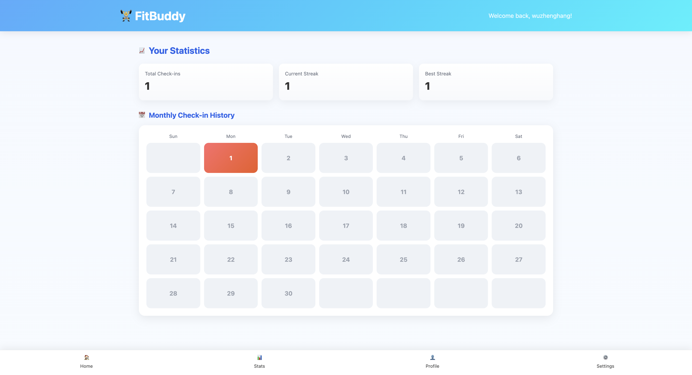

# FitBuddy

A full‑stack fitness tracker with daily check‑ins, streak stats, editable profile, settings, and an AI Fitness Assistant.

- Backend: Spring Boot 3 (Java 17), PostgreSQL, Spring Security, JPA/Hibernate, Redis (bitmap for check‑ins)
- Frontend: React + TypeScript + Vite, Redux Toolkit, Axios, Markdown rendering for AI
- AI: Gemini via `@google/generative-ai`

## Screenshots

<p align="center">
  
  <br/>
  <em>Home: daily check‑in + AI assistant</em>
  <br/><br/>
  
  <br/>
  <em>Statistics: totals, streaks, and monthly calendar</em>
  <br/>
</p>

## Monorepo layout

```
BackEnd/
  fitbuddy/               # Spring Boot app
FrontEnd/                 # React + Vite app
.vscode/screenshots/      # Images used in README
```

## Prerequisites

- Node.js 18+
- Java 17+
- Docker (for PostgreSQL & Redis via docker‑compose)

## Quick start (local)

1. Start Postgres & Redis with docker‑compose (DB on 5432, Redis on 6379):

```sh
docker-compose up -d
```

2. Configure Spring Boot datasource/redis (already set to localhost): `BackEnd/fitbuddy/src/main/resources/application.yml`

```yml
spring:
  datasource:
    url: jdbc:postgresql://localhost:5432/fitbuddy_db
    username: fitbuddy_user
    password: fitbuddy_password
  data:
    redis:
      host: localhost
      port: 6379
```

3. Run the backend (Spring Boot):

```sh
cd BackEnd/fitbuddy
./mvnw spring-boot:run
```

The server starts on http://localhost:8080

4. Run the frontend (Vite dev server):

```sh
cd FrontEnd
npm i
npm run dev
```

The app runs on http://localhost:5173

## Environment variables (frontend)

For the AI Fitness Assistant, set a Gemini API key:

- Create `FrontEnd/.env.local` with:

```
VITE_GEMINI_API_KEY=your_api_key_here
```

- Restart the Vite dev server after editing `.env.local`.

## Features

- Authentication: Register/Login endpoints (`/register`, `/login`).
- Daily Check‑in: Mark today, see weekly calendar, streak counters.
- Stats: Total check‑ins, Current Streak, Best Streak, Monthly calendar.
- Profile: View/Edit username, age, gender, primary goal, target weight.
- Settings: Language (English/中文), Theme (Light/Dark/System), Unit (Metric/Imperial).
- AI Assistant: Personalized workout/nutrition chat with Markdown rendering and streaming responses.

Performance note: Check-in reads/writes use a
Redis bitmap per user-year (key `checkin:{userId}:{year}`) for O(1) "checked today" and quick calendar synthesis;
historical data is backfilled from Postgres where needed.

## API overview

- `POST /register` – create user
- `POST /login` – login (returns id/email/username)
- `GET /checkin?userId` – whether user checked in today
- `POST /checkin?userId` – check‑in today
- `GET /checkin/calendar?userId&start=YYYY-MM-DD&end=YYYY-MM-DD` – list check‑ins in range
- `GET /checkin/month?userId&year=&month=` – list month check‑ins
- `GET /checkin/stats?userId` – streak stats
- `GET /users/{userId}/profile` – fetch user profile
- `PUT /users/{userId}/profile` – upsert profile

CORS is enabled for http://localhost:5173 with credentials; preflight (OPTIONS) is permitted.

## Tech notes

- Spring Security: CSRF disabled; explicit permit for auth, check‑in, user profile, and OPTIONS.
- JPA entities: `User`, `Checkin`, `UserCheckinStats`, `UserProfile` (with `@JsonIgnore` on user relation to avoid lazy‑proxy serialization issues).
- Frontend state: Redux Toolkit for auth and settings with localStorage persistence.
- AI chat: Uses `@google/generative-ai`; history starts with the first user message; model replies render as Markdown (GFM) to display lists and bold text cleanly.
- Redis: Bitmap service for check-ins (`SETBIT`/`GETBIT` via Spring Data Redis); DB backfill keeps historical rows intact for stats.

## Build/Deploy

- Frontend build:

```sh
cd FrontEnd
npm run build
```

- Backend jar:

```sh
cd BackEnd/fitbuddy
./mvnw -q -DskipTests package
```

You can host the frontend statics behind any web server and point it at the backend URL.

## Troubleshooting

- 403 on profile/check‑in from browser:
  - Ensure backend CORS allows localhost:5173 and OPTIONS requests.
  - Axios is configured with `withCredentials: true`.
- Gemini error "First content should be with role 'user'":
  - The chat history is built starting from the first user message; avoid injecting a model greeting into history.
- Duplicate AI bubbles:
  - Streaming UI uses a single placeholder model bubble updated in place.
